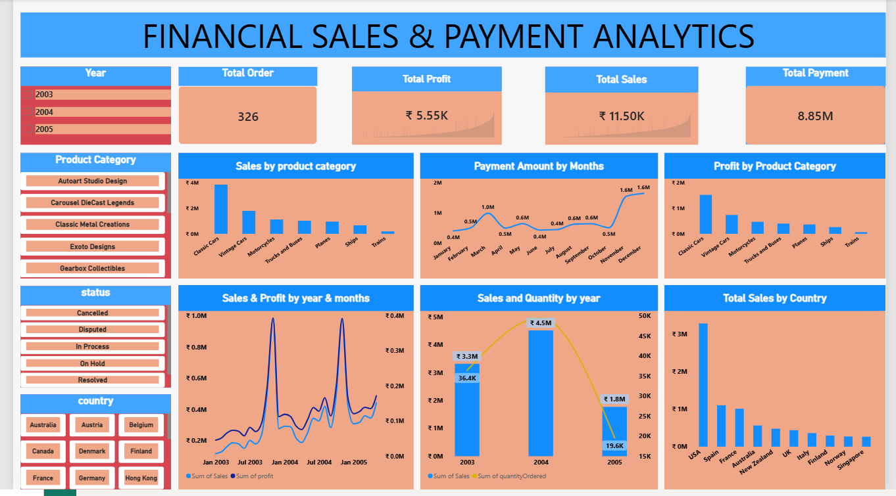

# Financial Sales & Payment Analytics

An end-to-end Data Analytics project analyzing sales, payments, customers, products, profitability, and order performance using Python, PostgreSQL, SQL, and Power BI.

## 📌 Project Overview

The objective of this project is to analyze financial sales and payment data and transform raw transactional data into meaningful business insights.

The project follows a complete data analytics workflow:

**Data Cleaning → Exploratory Data Analysis → SQL Analysis → Data Visualization → Business Insights**

## 🎯 Business Objectives

- Analyze overall sales and profitability
- Identify top-performing products and customers
- Analyze sales trends over time
- Understand payment patterns
- Compare sales across countries and product categories
- Analyze order status and shipping performance
- Identify profitable products and customers
- Support data-driven business decisions

## 🛠️ Tools & Technologies

- **Python** – Data cleaning and exploratory data analysis
- **Pandas** – Data manipulation and analysis
- **PostgreSQL** – Database management
- **SQL** – Data analysis and business queries
- **Power BI** – Interactive dashboard and visualization
- **GitHub** – Project documentation and version control

## 📂 Dataset

The project uses a Classic Models-style relational sales dataset containing:

- Customers
- Orders
- Order Details
- Payments
- Products
- Product Lines
- Offices
- Employees

The processed datasets are available in:

`data/processed/`

## 🔄 Project Workflow

### 1. Data Cleaning – Python

- Loaded multiple CSV datasets using Pandas
- Checked data types
- Checked missing values
- Checked duplicate records
- Converted date columns
- Removed unnecessary columns
- Created `ShippedDay` feature
- Merged product cost information
- Calculated Sales and Profit

### 2. Exploratory Data Analysis

Analyzed:

- Sales performance
- Profitability
- Product performance
- Customer performance
- Country-wise sales
- Payment trends
- Order status
- Shipping performance
- Sales representatives

### 3. PostgreSQL & SQL

Created a relational PostgreSQL database containing eight tables.

Performed SQL analysis including:

- Overall KPIs
- Sales by product category
- Top products
- Sales by year
- Monthly sales trends
- Sales by country
- Top customers
- Payment analysis
- Order status analysis
- Shipping analysis
- Product performance
- Sales representative performance

Created analytical views:

- `vw_sales_analysis`
- `vw_payment_analysis`
- `vw_customer_performance`

### 4. Power BI Dashboard

Built an interactive dashboard for monitoring:

- Total Orders
- Total Sales
- Total Profit
- Profit Margin
- Payment Amount
- Sales Trends
- Profit Trends
- Product Category Performance
- Country-wise Sales
- Customer Performance

## 📊 Dashboard Preview



## 📈 Key Analysis Areas

### Sales Analysis
Analyze revenue trends by year, month, product category, country, and customer.

### Profitability Analysis
Evaluate product and customer profitability using sales, cost, profit, and profit margin.

### Payment Analysis
Analyze payment amounts and payment trends over time.

### Customer Analysis
Identify high-value customers based on order volume, sales, and profit.

### Product Analysis
Identify top-performing products and products requiring further attention.

### Shipping Analysis
Analyze shipping duration and order delivery performance.

## 💡 Business Insights

The analysis helps answer questions such as:

- Which products generate the highest sales?
- Which products generate the highest profit?
- Which customers contribute the most revenue?
- Which countries generate the most sales?
- How do sales change over time?
- What are the major payment trends?
- Which orders have longer shipping times?
- Which sales representatives perform best?

## 📁 Project Structure

```text
financial-sales-payment-analytics/
│
├── data/
│   └── processed/
│       ├── customers_clean.csv
│       ├── employees_clean.csv
│       ├── offices_clean.csv
│       ├── order_details_clean.csv
│       ├── orders_clean.csv
│       ├── payments_clean.csv
│       ├── product_lines_clean.csv
│       └── products_clean.csv
│
├── python/
│   └── data_cleaning_eda.ipynb
│
├── sql/
│   ├── database_schema.sql
│   ├── analysis_queries.sql
│   └── views.sql
│
├── powerbi/
│   └── Financial_Sales_Payment_Analytics.pbix
│
├── screenshots/
│   └── dashboard.png
│
├── README.md
└── .gitignore